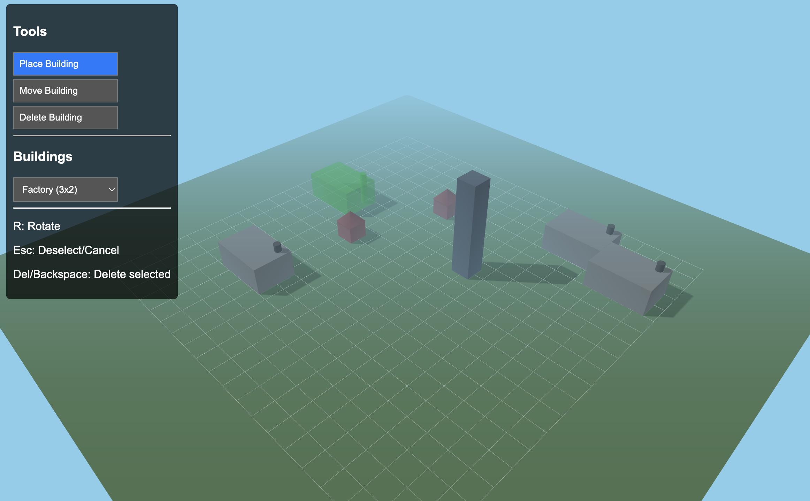

# LLM Stress Tests: Pushing the Boundaries of AI Code Generation

This repository is dedicated to exploring and stress-testing the capabilities of Large Language Models (LLMs) in code generation, particularly focusing on what they can achieve with minimal, concise, and sometimes ambiguous input.

## Mission

The core idea is to provide an LLM with a high-level concept or a set of core feature requests and observe its ability to:

*   Translate abstract requirements into functional code.
*   Select appropriate libraries and technologies (when not specified).
*   Implement complex logic and interactions.
*   Structure code for readability and maintainability (to varying degrees).
*   Handle implicit requirements and make reasonable assumptions.
*   Generate complete, runnable applications within given constraints (e.g., a single file).

## Why Stress Test?

*   **Understand Capabilities:** To gain a deeper understanding of current LLM strengths and weaknesses in practical software development scenarios.
*   **Identify Limits:** To find the "breaking points" where LLMs struggle or fail, providing insights into areas needing further research and development.
*   **Improve Prompt Engineering:** To learn how to formulate prompts more effectively to guide LLMs towards desired outcomes, especially for complex tasks.
*   **Showcase Potential:** To demonstrate the impressive potential of LLMs as tools for rapid prototyping, learning, and even production-level assistance.

## Live Demo

A live, unified demo of all projects is available via GitHub Pages:

**[View All Projects](https://juliusbrussee.github.io/ai-projects/)**

## Projects

| Project | LLM | Tags | Preview |
| --- | --- | --- | --- |
| [3D Village Builder](./projects/01-village-builder/README.md) | Gemini-2.5Pro | 3D, Game, Three.js |  |
| [Wealth Visualizer](./projects/02-wealth-visualizer/README.md) | Gemini-2.5Pro | 3D, Data-Viz, Three.js | |
| [Music Synthesizer](./projects/03-music-synthesizer/prompt.md) | Horizon-Beta | Audio, Music, WASM | |
| [Time-Travel Dashboard](./projects/04-time-travel-dashboard/prompt.md) | Horizon-Beta | 3D, Data-Viz, WebGL | |
| [Poetry Generator](./projects/05-poetry-generator/prompt.md) | Horizon-Beta | Poetry, Text-Gen | |
| [Solidity Generator](./projects/06-solidity-generator/prompt.md) | Horizon-Beta | Solidity, Code-Gen, Legal-Tech | |

## How to Interpret Results

The projects here are not necessarily examples of "best practices" in software engineering if a human were solely responsible. Instead, they are a reflection of the LLM's interpretation and execution based on the input provided. Manual clean-up or refinements by a human developer might be noted, but the initial output from the LLM is the primary focus.

## Contributing

While the primary goal is to document LLM-generated projects based on specific prompts, suggestions for new stress-test project ideas are welcome! Please open an issue to discuss your idea.

If you replicate a project or try a similar prompt with a different LLM, feel free to share your results and observations.

## License

This project is licensed under the MIT License. See the [LICENSE](./LICENSE) file for details.

## Disclaimer

> [!WARNING]
> The code generated by LLMs and hosted in this repository is for experimental and educational purposes. It may contain bugs, inefficiencies, or security vulnerabilities. Always review and test AI-generated code thoroughly before using it in critical applications.
